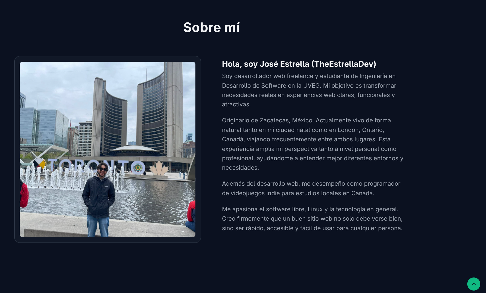

# 🌟 EstrellaDev Portfolio

<p align="center">
  
</p>

<p align="center">
  <strong>Modern • Responsive • Fast • Built with HTML, CSS & JavaScript</strong>
</p>

<p align="center">
  <a href="https://estrelladev.tech">
    
  </a>
  <a href="https://github.com/TheEstrellaDev">
    
  </a>
</p>

---

# 🚀 About

This repository contains the source code for my personal portfolio website.

The website showcases my work as a freelance web developer, highlights selected projects, and serves as a place where potential clients and recruiters can learn more about me and my services.

**Live Website**

🌐 https://estrelladev.tech

---

# ✨ Features

- Responsive design
- Modern UI
- Smooth animations
- Fast loading
- Vanilla JavaScript
- Project showcase
- Contact section
- SEO-friendly structure

---

# 🛠 Tech Stack

- HTML5
- CSS3
- JavaScript (ES6)

---

# 📁 Project Structure

```text
PORTAFOLIO/
│
├── css/
│   └── styles.css
│
├── js/
│   └── main.js
│
├── webs/
│   └── ...
│
├── favicon.svg
├── index.html
├── me.jpg
├── preview.png
├── README.md
└── .gitignore
```

---

# 👨‍💻 About Me

Hi! I'm **José Estrella**, a freelance web developer from **Zacatecas, Mexico**, currently studying **Software Development Engineering** at **UVEG (Universidad Virtual del Estado de Guanajuato).**

I enjoy building fast, responsive, and modern websites while continuously expanding my knowledge in web development, Linux, Python, Data Analytics, and Artificial Intelligence.

---

# 💼 Services

- Business Websites
- Landing Pages
- Portfolio Websites
- Website Redesign
- Responsive Design
- Website Maintenance

---

# 📬 Contact

🌐 Website

https://estrelladev.tech

🐙 GitHub

https://github.com/TheEstrellaDev

💼 LinkedIn

Coming Soon...

---

# ⭐ Support

If you like this project, consider giving it a ⭐ on GitHub.

It helps support my work and motivates me to continue building open-source projects and beautiful websites.

---

# 📄 License

Licensed under the MIT License.